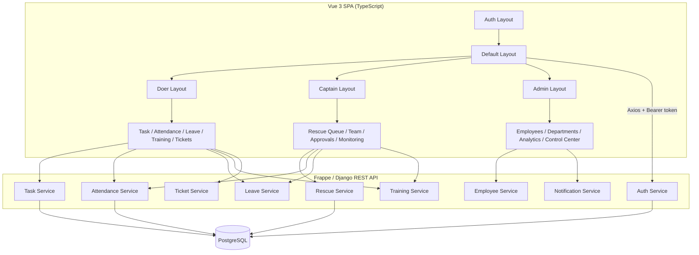
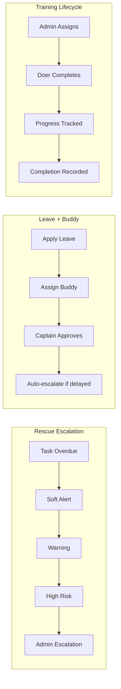

<div align="center">
  <picture>
    <source media="(prefers-color-scheme: dark)" srcset="frontend/src/assets/branding/logo-dark.svg">
    
  </picture>

  <br>

  **The Operating System for Indian MSMEs**

  <br>

  <a href="#quick-start"></a>
  <a href="frontend/package.json"></a>
  <a href="frontend/package.json"></a>
  <a href="frontend/package.json"></a>
  <a href="#license"></a>

  <br>

  <p>
    <b>Doer</b> &nbsp;·&nbsp; <b>Captain</b> &nbsp;·&nbsp; <b>Admin</b> &nbsp;—&nbsp; three panels, one platform.
  </p>
</div>

---

## Overview

OptiFlow OS is a workflow, operations, and HRMS platform built for **Indian MSMEs** (10–500 employees). It replaces spreadsheets, WhatsApp-based coordination, and disconnected tools with a single execution platform.

**Three integrated panels:**

| Role | Panel | Who |
|------|-------|-----|
| **Doer** | Task execution, attendance, leave, training | Frontline employees |
| **Captain** | Team monitoring, approvals, rescue queue | Managers / Team leaders |
| **Admin** | Employee lifecycle, departments, analytics, system config | Business owners / Admins |

**The problem it solves:**

Tasks go untracked, accountability is unclear, SOPs aren't followed, and managers spend more time following up than managing. OptiFlow provides structured workflows, real-time visibility, automatic escalation, and role-based accountability.

**Target:** Manufacturing units, logistics, retail chains, warehouses, and service businesses with 10–500 employees.

---

## Quick Start

```bash
git clone https://github.com/your-org/optiflow-os.git
cd optiflow-os/frontend
npm install
cp .env.example .env.development
npm run dev
```

The app runs at **`http://localhost:3000`**.

### Demo Credentials

| Role | Employee ID | Password |
|------|-------------|----------|
| Admin | `EMP-0001` | `Pass@123` |
| Captain | `EMP-0002` | `Pass@123` |
| Doer | `EMP-0004` | `Pass@123` |

### Build for Production

```bash
npm run build     # Outputs to frontend/dist/
npm run preview   # Preview production build
```

### Run Checks

```bash
npx vue-tsc --noEmit   # Type check
npm run lint            # Lint
npm test                # Unit tests
npm run test:e2e        # E2E tests (Playwright)
```

---

## Screenshots

### Authentication

| Login | Mobile OTP |
|-------|-----------|
|  |  |

### Doer Panel

| Dashboard | My Tasks | My Worklist |
|-----------|----------|-------------|
|  |  |  |

| Attendance | Leave | Training |
|------------|-------|----------|
|  |  |  |

| Help Tickets | Notifications | Profile |
|--------------|---------------|---------|
|  |  |  |

### Captain Panel

| Dashboard | Rescue Queue | Team |
|-----------|-------------|------|
|  |  |  |

| Worklists | Leave Approvals | Attendance |
|-----------|----------------|------------|
|  |  |  |

| Training | Tickets | Profile |
|----------|---------|---------|
|  |  |  |

### Admin Panel

| Dashboard | Employees | Departments |
|-----------|-----------|-------------|
|  |  |  |

| Attendance | Leave | Training |
|------------|-------|----------|
|  |  |  |

| Tickets | Insights | Control Center |
|---------|----------|----------------|
|  |  |  |

---

## Architecture

### Role Hierarchy & Data Flow



### Key Workflows



### Frontend Layers

```
Pages (lazy-loaded per route)
  └─ Stores (Pinia — state + cache + persistence)
       └─ Services (BaseService — cache TTL 30s, dedup, retry 3×)
            └─ API Client (Axios — auth header, CSRF, timeout, 401 redirect)
                 └─ Backend (Frappe/Django REST endpoints)
```

---

## Technology Stack

| Layer | Technology | Purpose |
|-------|-----------|---------|
| **UI** | Vue 3 + TypeScript + Vite 8 | Composition API, strict typing, fast builds |
| **Styling** | Tailwind CSS 3 + Headless UI | Utility-first CSS, accessible primitives |
| **State** | Pinia 3 + Vue Router 4 | Modular stores, lazy routes, auth guards |
| **HTTP** | Axios | Interceptors, retry, CSRF |
| **i18n** | vue-i18n 11 | EN / HI / Hinglish |
| **Testing** | Vitest + Playwright | Unit + E2E |
| **Monitoring** | Sentry + web-vitals | Error tracking, performance metrics |
| **Backend** | Frappe / Django + PostgreSQL | REST API (planned / in development) |

---

## Modules

| Module | Doer | Captain | Admin |
|--------|------|---------|-------|
| Task Management | ✅ Execute | ✅ Assign & Review | ✅ Full access |
| Attendance | ✅ Check in/out | ✅ Monitor team | ✅ Org-wide view |
| Leave | ✅ Apply + Buddy | ✅ Approve/Reject | ✅ Manage |
| Training | ✅ Complete | ✅ Assign | ✅ Create & assign |
| Help Tickets | ✅ Raise | ✅ Respond | ✅ Full resolution |
| Worklists | ✅ Execute checklists | ✅ Manage assignments | — |
| Rescue Queue | — | ✅ Monitor & escalate | ✅ Oversight |
| Employee Mgmt | — | ✅ View team | ✅ Full lifecycle |
| Departments | — | — | ✅ Create & manage |
| Analytics | — | ✅ Team insights | ✅ Org-wide analytics |
| Control Center | — | — | ✅ Settings, roles, audit logs |
| Notifications | ✅ Personal | ✅ Team | ✅ Broadcast |

---

## Environment Variables

| Variable | Default | Description |
|----------|---------|-------------|
| `VITE_API_BASE_URL` | `http://localhost:8000` | Backend API base URL |
| `VITE_API_TIMEOUT` | `15000` | Request timeout (ms) |
| `VITE_ENABLE_MOCK` | `true` | Mock data fallback in dev |
| `VITE_OFFICE_START_TIME` | `09:00` | Late arrival threshold |
| `VITE_DEFAULT_LANGUAGE` | `en` | Default UI language |

---

## Project Structure

```
optiflow-os/
├── frontend/
│   ├── src/
│   │   ├── api/            # Axios client, endpoints, types
│   │   ├── assets/         # Branding assets (logo, favicon)
│   │   ├── components/     # Design system (Opt*) + navigation
│   │   ├── composables/    # Reusable Vue composition functions
│   │   ├── layouts/        # AuthLayout, DefaultLayout, role layouts
│   │   ├── locales/        # en.json, hi.json, hinglish.json
│   │   ├── mock/           # Development mock data
│   │   ├── pages/          # auth/, doer/, captain/, admin/
│   │   ├── router/         # Route definitions + guards
│   │   ├── services/       # API service layer (cache, dedup, retry)
│   │   ├── stores/         # Pinia stores (auth, tasks, attendance, ...)
│   │   ├── styles/         # Tailwind entry + design tokens
│   │   ├── types/          # TypeScript interfaces
│   │   └── utils/          # Formatters, validators, permissions, logger
│   ├── public/             # Static assets (favicon.svg)
│   ├── index.html
│   ├── vite.config.ts
│   └── package.json
├── docs/                   # Architecture, design system, workflows
├── screens/                # Screenshot gallery
└── CLAUDE.md               # AI-assisted development guide
```

---

## Roadmap

| Phase | Focus |
|-------|-------|
| **Current** | Production hardening — API integration, error/loading/empty states, security audit |
| **v1.0** | All modules complete (rescue, worklist, training, attendance, leave, tickets, notifications, multi-language, dark mode, offline, PWA) |
| **Next** | AI prioritization & rescue prediction, advanced analytics, WhatsApp integration |
| **Future** | Mobile apps, biometric attendance, payroll integration, supply chain, multi-location |

---

## Contributing

See [CONTRIBUTING.md](CONTRIBUTING.md) for guidelines.

- [Code of Conduct](CODE_OF_CONDUCT.md)
- [Security Policy](SECURITY.md)
- [Changelog](CHANGELOG.md)

### PR Checklist

- [ ] `vue-tsc --noEmit` passes
- [ ] `npm run lint` passes
- [ ] `npm test` passes
- [ ] Implements loading, empty, error, and retry states
- [ ] Mobile responsive
- [ ] Follows design system conventions

---

## Documentation

- [Frontend Architecture](docs/frontend/MASTER_FRONTEND_ARCHITECTURE.md)
- [Component Library](docs/components/COMPONENT_LIBRARY.md)
- [Design System](docs/design-system/DESIGN_SYSTEM.md)
- [Route Map](docs/routes/ROUTES_MAP.md)
- [Screen Inventory](docs/screens/SCREEN_INVENTORY.md)
- [UI/UX Specification](docs/uiux/UI_UX_SPECIFICATION.md)
- [Workflow Mapping](docs/workflows/WORKFLOW_UI_MAPPING.md)
- [Architecture Decisions](docs/adr/)

---

## License

**Proprietary Software** — Copyright © OptiFlow Technologies. All rights reserved.

See [LICENSE](LICENSE) for terms.

---

## Support

- **Email:** support@optiflowos.com
- **Issues:** GitHub Issues
- **In-app:** Built-in Help Desk ticketing system

---

<div align="center">
  <sub>Built with Vue 3, TypeScript, and Tailwind CSS for Indian MSMEs.</sub>
</div>
