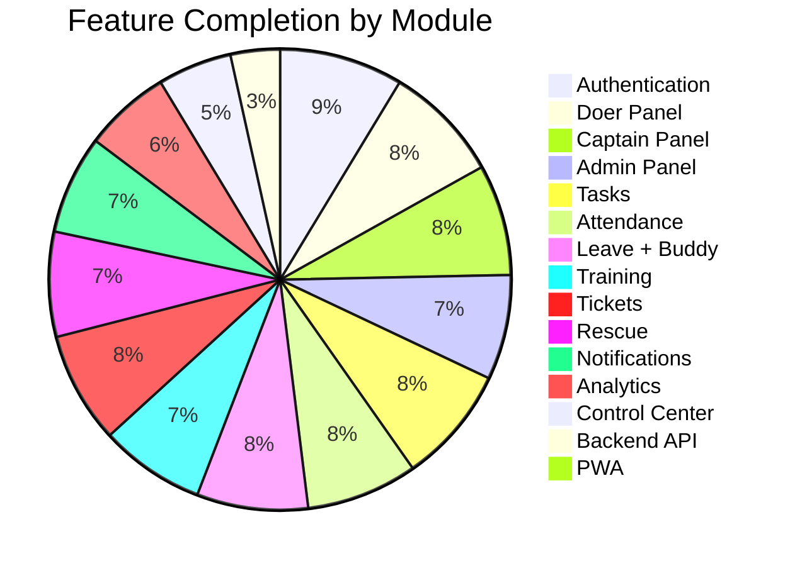
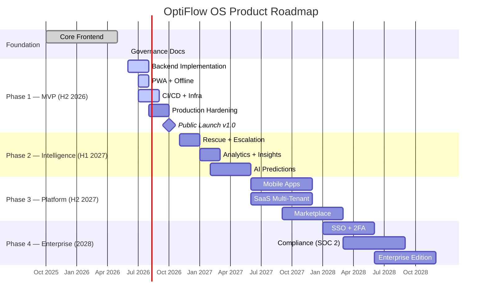
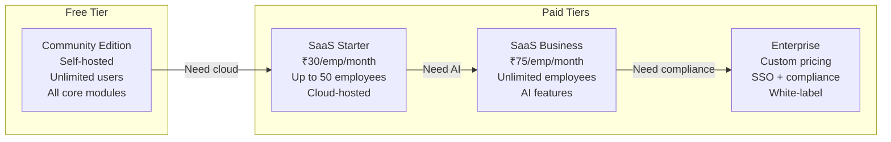
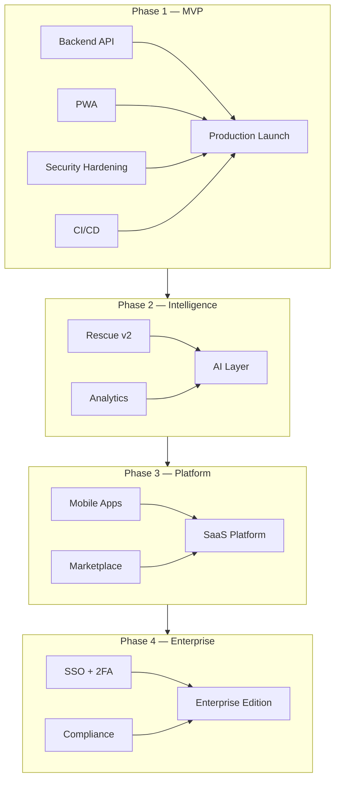

# OptiFlow OS Roadmap

**Last updated**: June 2026
**Current version**: [0.8.0](CHANGELOG.md#080--2026-06-07--governance--community-foundation)
**Product**: OptiFlow OS — Operating System for Indian MSMEs
**License**: [Open Core (AGPL v3 + Commercial)](LICENSE.md)

---

## Overview

OptiFlow OS is a workflow, operations, and HRMS platform for Indian MSMEs (10–500 employees). It replaces spreadsheets, WhatsApp-based coordination, and disconnected tools with a single execution platform featuring three role-based panels (Doer, Captain, Admin).

This roadmap outlines the product's evolution from its current MVP-ready state through AI-powered enterprise platform over a 5-year horizon.

---

## Current State — June 2026

| Dimension | Status | Readiness |
|-----------|--------|-----------|
| **Frontend** | 44 pages across 4 panels, 22 design system components, 9 Pinia stores, 13 services | ✅ MVP Ready |
| **Authentication** | 5-page flow (login, OTP, forgot/reset, wizard), JWT with session management | ✅ Production Ready |
| **Backend** | Endpoints defined, service layer ready, but no live backend | ⚠️ Mock data mode |
| **Offline** | Mutation queue with localStorage persistence and auto-sync | ✅ Implemented |
| **PWA** | `vite-plugin-pwa` installed but not configured | 🔧 Not started |
| **CI/CD** | No automated pipelines | 🔧 Not started |
| **Documentation** | 7 OSS standard files complete (README, LICENSE, SECURITY, CONTRIBUTING, CODE_OF_CONDUCT, CHANGELOG) | ✅ Complete |
| **Localization** | English (618 keys), Hindi, Hinglish | ✅ Implemented |

---

## Product Vision

### Mission

Help Indian MSMEs streamline operations, workforce management, accountability, SOP execution, and organizational performance through a single execution platform.

### Vision

To become the operating system for Indian MSMEs — the single platform where work is assigned, tracked, executed, reviewed, and improved across every department and role.

### Target Market

| Segment | Size (India) | Problem |
|---------|-------------|---------|
| Manufacturing units | ~250,000 | SOP compliance, shift management, quality tracking |
| Logistics & distribution | ~150,000 | Route checklists, delivery tracking, driver attendance |
| Retail chains & warehouses | ~200,000 | Multi-location ops, stock tasks, store checklists |
| Service businesses | ~300,000 | Job assignment, field attendance, client escalation |
| **Total TAM** | **~900,000 MSMEs** | All need operations + HRMS in one platform |

### Competitive Landscape

| Competitor | Strength | OptiFlow Advantage |
|------------|----------|-------------------|
| Zoho People | HRMS maturity | Operations + HRMS in one; Rescue engine; MSME pricing |
| Keka | Payroll integration | Workflow-first design; Offline support; Multi-language |
| greytHR | Compliance features | No-code workflow builder; Open source option |
| BambooHR | UX polish | Indian MSME focus; Affordability; Doer/Captain/Admin model |

---

## Strategic Roadmap

---

## Timeline Overview

| Quarter | Phase | Focus | Key Deliverables |
|---------|-------|-------|-----------------|
| **Q3 2026** | 1 — MVP | Backend, hardening, launch | Live API, PWA, v1.0 release |
| **Q4 2026** | 1 — MVP | Launch + first customers | Public GitHub release, onboarding first 10 orgs |
| **Q1 2027** | 2 — Intelligence | Rescue, analytics | Rescue engine v2, insights dashboard |
| **Q2 2027** | 2 — Intelligence | AI layer | Task prioritization, rescue prediction |
| **H2 2027** | 3 — Platform | Mobile, SaaS, Marketplace | Android/iOS apps, multi-tenant SaaS |
| **2028** | 4 — Enterprise | Enterprise features | SSO, compliance, enterprise edition |

---

## Phase 1 — MVP & Launch (H2 2026)

**Goal**: Production-ready v1.0 with live backend, PWA support, and first paying customers.

### Milestones

| Milestone | Target Date | Status |
|-----------|------------|--------|
| Backend API implementation (Frappe/Django) | Aug 2026 | 🔜 Planned |
| PWA service worker + manifest | Aug 2026 | 🔜 Planned |
| Docker Compose full-stack setup | Sep 2026 | 🔜 Planned |
| CI/CD pipelines (GitHub Actions) | Sep 2026 | 🔜 Planned |
| Security hardening (CSP, HSTS, httpOnly cookies) | Oct 2026 | 🔜 Planned |
| **v1.0 public release** | **Oct 2026** | 🎯 Target |
| First 10 paying organizations | Dec 2026 | 🎯 Target |

### Deliverables

| Area | Items |
|------|-------|
| **Backend** | Frappe/Django REST API for all 12 modules; PostgreSQL database; Redis for caching + real-time; Rate limiting (login, API); Server-side input validation; Account lockout after N failures |
| **PWA** | Service worker registration; Offline asset caching; Web app manifest (192px + 512px icons); Install prompt |
| **Infrastructure** | GitHub Actions (lint → type-check → test → build); Docker Compose for local full-stack dev; Nginx config for SPA + API proxy; `.github/ISSUE_TEMPLATE/` — Bug + Feature templates; Dependabot + Renovate config |
| **Security** | CSP headers; HSTS; `X-Content-Type-Options: nosniff`; Auth token → httpOnly cookie; Server-side input validation; Account lockout; Session invalidation on logout |
| **QA** | 90% store test coverage; 80% service coverage; E2E tests for all 3 panels; Load testing results published |

### Risks & Mitigation

| Risk | Likelihood | Impact | Mitigation |
|------|-----------|--------|------------|
| Backend development delays | Medium | High | Mock data allows frontend QA in parallel |
| PWA complexity | Low | Medium | `vite-plugin-pwa` already installed; configuration-only |
| Low initial adoption | Medium | High | Free self-hosted Community Edition; targeted outreach to manufacturing associations |

---

## Phase 2 — Operations Intelligence (H1 2027)

**Goal**: AI-powered operations with predictive rescue, advanced analytics, and intelligent insights.

### Milestones

| Milestone | Target Date | Status |
|-----------|------------|--------|
| Rescue engine v2 (rule-based → ML) | Jan 2027 | 🔜 Planned |
| Advanced analytics dashboard | Mar 2027 | 🔜 Planned |
| AI Task Prioritization MVP | Apr 2027 | 🔜 Planned |
| AI Rescue Prediction MVP | Jun 2027 | 🔜 Planned |

### Deliverables

| Area | Items |
|------|-------|
| **Rescue v2** | ML-based delay prediction; Severity auto-classification by task type/department; Recommended action suggestions; Captain workload balancing |
| **Analytics** | Role-specific dashboards (Doer: personal trends, Captain: team, Admin: org); Export to PDF/CSV; Configurable date ranges and filters; Pre-built report templates |
| **AI** | Task priority scoring based on deadline, dependencies, assignee load; Rescue likelihood scoring before tasks go overdue; Attendance anomaly detection; Leave pattern predictions for capacity planning; Smart ticket routing and auto-suggested responses |

### Risks & Mitigation

| Risk | Likelihood | Impact | Mitigation |
|------|-----------|--------|------------|
| AI model accuracy | Medium | Medium | Rule-based fallback; start with heuristic scoring before ML |
| Data volume insufficient for ML | High | Medium | Synthetic data generation; use MSME-pattern-approximating models |
| Feature scope creep | Medium | High | Strict MVP definition for each AI feature; defer complex models |

---

## Phase 3 — Platform Expansion (H2 2027)

**Goal**: Mobile apps, SaaS multi-tenancy, and extension marketplace.

### Milestones

| Milestone | Target Date | Status |
|-----------|------------|--------|
| Android app v1 | Sep 2027 | 🔜 Planned |
| iOS app v1 | Oct 2027 | 🔜 Planned |
| SaaS multi-tenant architecture | Nov 2027 | 🔜 Planned |
| Extension marketplace v1 | Dec 2027 | 🔜 Planned |

### Deliverables

| Area | Items |
|------|-------|
| **Mobile** | React Native or Flutter apps; Core workflows: tasks, attendance, leave, tickets; Push notifications; Offline-first (sync when online); Biometric authentication |
| **SaaS** | Multi-tenant database strategy; Tenant provisioning and isolation; Subscription management (monthly/annual); Usage-based billing (per active employee); Trial management |
| **Marketplace** | Extension SDK and documentation; Plugin architecture (hooks, webhooks, API); Developer portal; Revenue sharing terms (80/20); Featured extensions: WhatsApp integration, payroll connectors, biometric devices |

### Risks & Mitigation

| Risk | Likelihood | Impact | Mitigation |
|------|-----------|--------|------------|
| Mobile development cost | Medium | High | Start with React Native (code sharing); defer iOS if needed |
| Marketplace chicken-egg problem | High | Medium | Build 3–5 first-party integrations to seed the marketplace |
| Multi-tenant complexity | Medium | High | Schema-based isolation (simpler than silo DBs); migrate later |

---

## Phase 4 — Enterprise Edition (2028)

**Goal**: Enterprise-ready with SSO, compliance certifications, and advanced controls.

### Milestones

| Milestone | Target Date | Status |
|-----------|------------|--------|
| SSO / SAML / OIDC | Apr 2028 | 🔜 Planned |
| 2FA / TOTP | Jun 2028 | 🔜 Planned |
| SOC 2 Type I readiness | Sep 2028 | 🔜 Planned |
| Enterprise Edition launch | Dec 2028 | 🔜 Planned |

### Deliverables

| Area | Items |
|------|-------|
| **Enterprise** | SSO (SAML 2.0, OIDC, Google Workspace, Azure AD); 2FA (TOTP, SMS backup codes); Advanced RBAC (custom roles, department-scoped permissions); Audit log retention (configurable, 7yr archival); Read-only auditor role; IP whitelisting; Session policies (max duration, concurrent session control) |
| **Compliance** | SOC 2 Type I (security, availability, confidentiality); SOC 2 Type II (6-month observation); ISO 27001 readiness; GDPR Data Processing Agreement; India DPDP Act compliance |
| **Integrations** | WhatsApp Business API (notifications, leave approval, ticket updates); Payroll export (Zoho, Keka, QuickBooks); Biometric device integration (face, fingerprint); Custom workflow builder (drag-and-drop) |

### Risks & Mitigation

| Risk | Likelihood | Impact | Mitigation |
|------|-----------|--------|------------|
| Compliance cost | High | Medium | Start with SOC 2 Type I (lower cost); customer demand will justify Type II |
| Enterprise sales cycle | High | Medium | Self-serve Community Edition builds trust; convert to Enterprise via feature need |
| Regulatory changes (DPDP Act) | Medium | High | Monitor legislation; build privacy-first architecture from Phase 1 |

---

## Phase 5 — Global Platform (2029+)

**Goal**: Multi-language, multi-currency, global presence with AI co-pilot.

| Milestone | Target | Description |
|-----------|--------|-------------|
| 5 new languages | 2029 | Tamil, Telugu, Kannada, Marathi, Bengali (India); Bahasa, Vietnamese (SE Asia) |
| Multi-currency pricing | 2029 | INR, USD, SGD, MYR, AED |
| Regional compliance | 2029–2030 | SE Asia data residency, GST/VAT handling |
| AI Co-pilot | 2030 | Natural language query interface; Auto-report generation; Voice commands for attendance/tasks |
| Global marketplace | 2030 | Third-party extensions from global developers |
| Scale | 2031+ | 10,000+ organizations; 500,000+ active employees; Multi-factory/multi-location enterprise support |

---

## Technical Roadmap

### Frontend

| Quarter | Focus | Details |
|---------|-------|---------|
| Q3 2026 | PWA | Service worker, manifest, offline caching |
| Q4 2026 | Performance | Bundle size audit, chunk optimization, web vitals tuning |
| H1 2027 | Component library v2 | 10 new Opt* components, storybook documentation |
| H2 2027 | Mobile | React Native app (tasks, attendance, leave, tickets) |
| 2028 | Design system evolution | Dark+HC refinement, responsive v2, animation system |

### Backend (Frappe/Django)

| Quarter | Focus | Details |
|---------|-------|---------|
| Q3 2026 | Core API | All 12 module endpoints, auth (JWT + httpOnly cookie), RBAC enforcement |
| Q4 2026 | Real-time | WebSocket for notifications, SSE for live updates |
| H1 2027 | Intelligence | ML service integration, predictive endpoints |
| H2 2027 | SaaS | Multi-tenant middleware, subscription API |
| 2028 | Enterprise | SSO integration, audit log service, compliance exports |

### Security

| Quarter | Focus | Details |
|---------|-------|---------|
| Q3 2026 | Hardening | CSP, HSTS, token migration, server-side validation, rate limiting |
| H1 2027 | Testing | Penetration testing, dependency auditing, automated security scanning |
| 2028 | Compliance | SOC 2 controls, GDPR readiness, encryption at rest |

### Infrastructure

| Quarter | Focus | Details |
|---------|-------|---------|
| Q3 2026 | CI/CD | GitHub Actions, Docker Compose, staging environment |
| Q4 2026 | Monitoring | Sentry production config, uptime monitoring, health checks |
| H2 2027 | SaaS | Multi-tenant deployment, auto-scaling, CDN |
| 2028 | Enterprise | High-availability, disaster recovery, global CDN |

---

## Open Source Roadmap

### Community Growth Targets

| Metric | Current | Q4 2026 | 2027 | 2028 |
|--------|---------|---------|------|------|
| GitHub Stars | — | 200 | 1,000 | 5,000 |
| Contributors | 1 | 10 | 50 | 200 |
| Forks | — | 20 | 100 | 500 |
| Community Edition deployments | — | 50 | 500 | 5,000 |
| Translation languages | 3 | 5 | 8 | 12 |

### Community Initiatives

| Initiative | Timeline | Description |
|-----------|----------|-------------|
| GitHub Discussions | Q3 2026 | Q&A, ideas, RFCs |
| Issue templates + labels | Q3 2026 | Bug, feature, discussion, good first issue |
| CONTRIBUTORS.md + Hall of Fame | Q4 2026 | Contributor recognition |
| Community Discord/Telegram | Q4 2026 | Real-time community chat |
| Monthly community calls | Q1 2027 | Product updates, contributor spotlights |
| Contributor workshops | H1 2027 | "How to build an OptiFlow plugin" |
| Bug bounty program | 2028 | Security researcher incentives |

---

## Business Roadmap

### Revenue Streams

| Stream | Launch | Model | Target MRR by 2028 |
|--------|--------|-------|-------------------|
| **Enterprise License** | Q4 2026 | Per-employee/month | ₹15L |
| **SaaS Cloud** | H2 2027 | Per-active-employee/month | ₹25L |
| **Marketplace** | H2 2027 | 20% commission | ₹5L |
| **Implementation Services** | 2027 | Fixed fee + hourly | ₹3L |
| **Training & Certification** | 2027 | Per-seat | ₹2L |

### Go-to-Market

| Phase | Channel | Focus |
|-------|---------|-------|
| Launch (Q4 2026) | Direct sales + LinkedIn | Manufacturing clusters (Tamil Nadu, Gujarat, Maharashtra) |
| Growth (2027) | Partner network + WhatsApp | ERPNext partners, MSME associations, industry bodies |
| Scale (2028) | Inbound + content marketing | Video tutorials, case studies, comparison guides |

### Pricing Model

---

## AI Roadmap

| Feature | Complexity | Timeline | Status |
|---------|-----------|----------|--------|
| Rule-based task priority scoring | Low | Q1 2027 | 🔜 Planned |
| Rescue likelihood prediction | Medium | Q2 2027 | 🔜 Planned |
| Attendance anomaly detection | Medium | Q2 2027 | 🔜 Planned |
| Leave pattern predictions | Medium | Q2 2027 | 🔜 Planned |
| Smart ticket routing (NLP) | High | Q3 2027 | 🔜 Planned |
| Auto-suggested ticket responses | High | Q4 2027 | 🔜 Planned |
| AI Performance analysis | High | Q1 2028 | 🔜 Planned |
| AI Workflow recommendations | High | Q2 2028 | 🔜 Planned |
| Natural language query interface | Very High | 2029 | 🔮 Vision |
| Voice commands (attendance, tasks) | Very High | 2030 | 🔮 Vision |

---

## Dependency Map

---

## Key Metrics Dashboard

We will track the following metrics publicly and update them quarterly:

| Category | Metric | Q4 2026 Target | 2027 Target |
|----------|--------|---------------|-------------|
| **Adoption** | Organizations using OptiFlow OS | 50 | 500 |
| **Adoption** | Active employees | 2,500 | 50,000 |
| **Community** | GitHub Stars | 200 | 1,000 |
| **Community** | Contributors | 10 | 50 |
| **Usage** | Tasks created (monthly) | 50,000 | 500,000 |
| **Usage** | Attendance records (monthly) | 25,000 | 250,000 |
| **Quality** | Test coverage | 80% | 90% |
| **Quality** | Uptime (SaaS) | 99.5% | 99.9% |
| **Revenue** | MRR | ₹2L | ₹20L |

---

## Commitment to Open Core

| Principle | Policy |
|-----------|--------|
| **Community Edition** | Always free, AGPL v3 licensed, all core modules included |
| **No feature stripping** | Community Edition will never lose existing features |
| **Source availability** | All Community Edition source code is public |
| **Clear boundaries** | Enterprise features are clearly documented, never hidden |
| **Fair pricing** | SaaS pricing is per-active-employee, reasonable for MSMEs |
| **No bait-and-switch** | Feature moves from Community to Enterprise require 1-year deprecation notice |

---

## Appendix: Module Maturity Matrix

| Module | Frontend | Backend | Tests | Mock | Production Ready |
|--------|----------|---------|-------|------|-----------------|
| Authentication | ✅ 5 pages | ✅ endpoints | ⬜ | ✅ | ⚠️ needs backend |
| Doer Dashboard | ✅ | ✅ endpoints | ⬜ | ✅ | ⚠️ needs backend |
| My Tasks | ✅ | ✅ endpoints | ⬜ | ✅ | ⚠️ needs backend |
| Worklists | ✅ | ✅ endpoints | ⬜ | ✅ | ⚠️ needs backend |
| Attendance | ✅ 3 pages | ✅ endpoints | ⬜ | ✅ | ⚠️ needs backend |
| Leave + Buddy | ✅ 3 pages | ✅ endpoints | ⬜ | ✅ | ⚠️ needs backend |
| Training | ✅ 3 pages | ✅ endpoints | ⬜ | ✅ | ⚠️ needs backend |
| Tickets | ✅ 4 pages | ✅ endpoints | ⬜ | ✅ | ⚠️ needs backend |
| Rescue | ✅ 2 pages | ✅ endpoints | ⬜ | ✅ | ⚠️ needs backend |
| Notifications | ✅ 3 pages | ✅ endpoints | ⬜ | ✅ | ⚠️ needs backend |
| Employee Mgmt | ✅ 3 pages | ✅ endpoints | ⬜ | ✅ | ⚠️ needs backend |
| Department Mgmt | ✅ 2 pages | ✅ endpoints | ⬜ | ✅ | ⚠️ needs backend |
| Insights | ✅ 5 pages | ⬜ | ⬜ | ⬜ | ⬜ |
| Control Center | ✅ 5 pages | ⬜ | ⬜ | ⬜ | ⬜ |
| PWA | ⬜ | ⬜ | ⬜ | ⬜ | ⬜ |
| Backend | ⬜ | ⬜ | ⬜ | ✅ | ⬜ |

**Legend**: ✅ Complete · ⚠️ Partial · ⬜ Pending

---

## How to Use This Roadmap

- **Contributors**: See [CONTRIBUTING.md](CONTRIBUTING.md) for how to pick up roadmap items
- **Customers**: Roadmap items are targets, not guarantees. Priorities may shift based on feedback
- **Investors**: This roadmap represents our public product strategy. Internal strategy may include additional items
- **Partners**: Integrations and marketplace opportunities are noted — reach out to discuss

---

## Feedback & Suggestions

This roadmap is a living document. We encourage feedback:

| Channel | Purpose |
|---------|---------|
| GitHub Issues | Feature requests, roadmap suggestions |
| GitHub Discussions | Strategic discussions, priorities |
| Email | roadmap@optiflowos.com |

---

## Revision History

| Date | Author | Changes |
|------|--------|---------|
| June 2026 | OptiFlow Technologies | Initial roadmap for v0.8.0 |

---

*OptiFlow OS — Operating System for Indian MSMEs*

*Copyright © OptiFlow Technologies. All rights reserved.*
