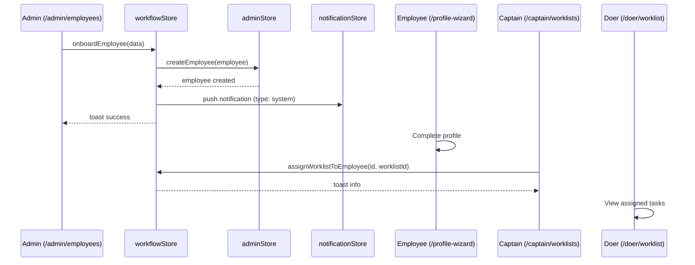
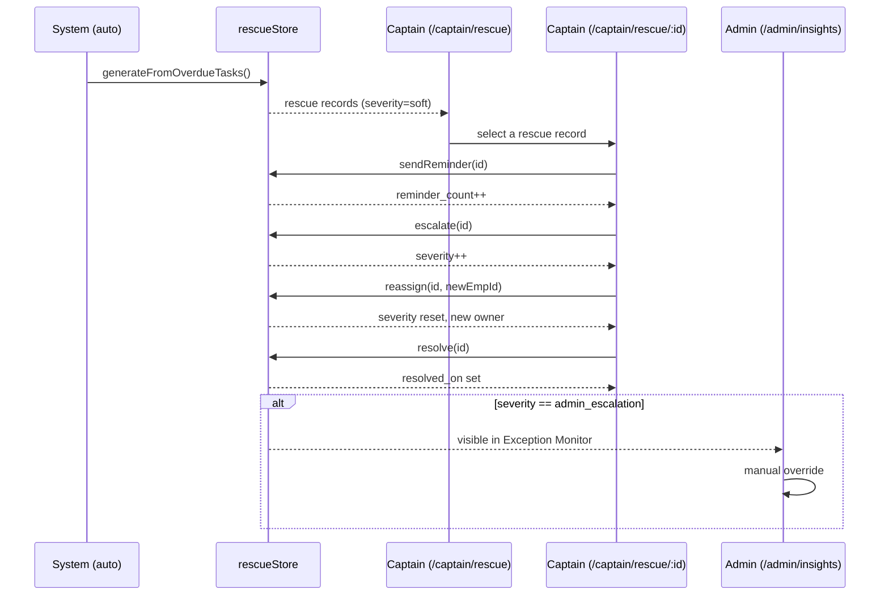
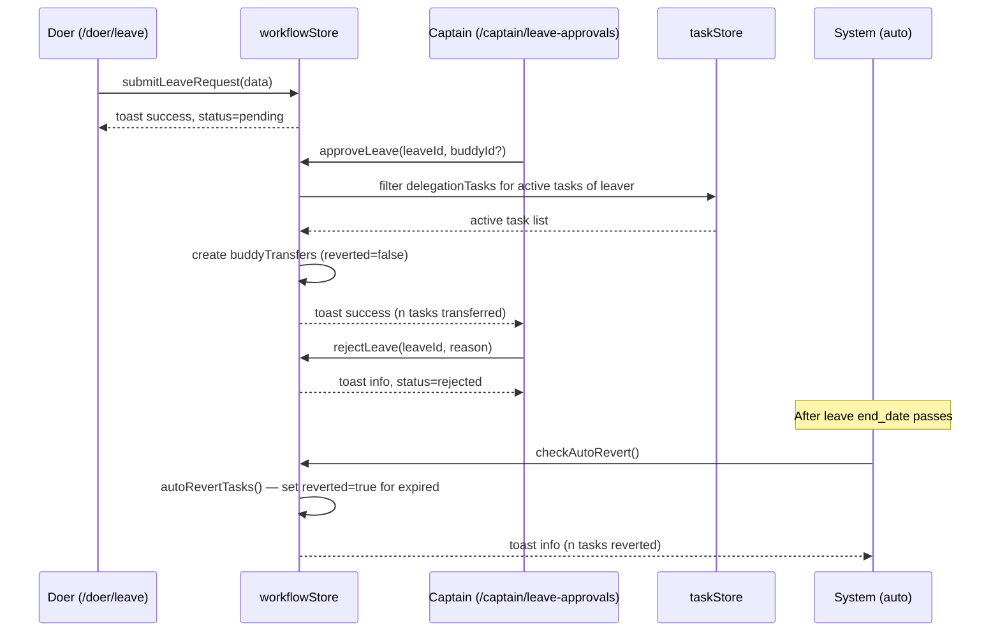

# OptiFlow OS — Workflow ↔ UI Mapping

| Workflow | ID | Panels | Primary Store |
|----------|----|--------|---------------|
| Onboarding | W1 | Admin → System → Employee → Captain → Doer | `workflowStore`, `adminStore` |
| Rescue | W2 | System → Captain → Admin | `rescueStore`, `workflowStore` |
| Leave & Buddy Transfer | W3 | Doer → Captain → System → (auto-revert) | `workflowStore`, `taskStore` |

---

## W1: Onboarding Flow

```
admin ──[create employee]──> system ──[assign ID + notify]──> employee ──[complete profile]──> captain ──[assign worklist]──> doer
```

| Step | Screen Name | Route | Actor | Action | State Transition |
|------|-------------|-------|-------|--------|-----------------|
| 1 | Employee Management | `/admin/employees` | Admin | Fills form with name, department, designation, mobile, reporting_captain | — |
| 2 | Employee Management (Add Modal) | `/admin/employees` | Admin | Submits `onboardEmployee(data)` → `adminStore.createEmployee(employee)` | Employee created with status `active`, roles `['doer']`, ID `EMP-NNNN` |
| 3 | System (background) | — | System | Generates `EMP-NNNN` ID, pushes notification to `notificationStore` | Notification type `system` with link `/admin/employees/{id}` |
| 4 | Admin Dashboard | `/admin` | Admin | Sees success toast + notification badge | Confirmation via `useStore.addToast` |
| 5 | Profile Wizard | `/profile-wizard` | Employee | Completes profile (avatar, bank details, preferences) | `user.employee` populated after auth |
| 6 | Worklist Management | `/captain/worklists` | Captain | `assignWorklistToEmployee(employeeId, worklistId)` | Worklist linked to employee record |
| 7 | My Worklist / My Tasks | `/doer/worklist` or `/doer/tasks` | Doer | Views assigned tasks and worklist items | Task list reflects new assignments |

### Diagram



### Error / Edge Cases

| Step | Failure | Outcome |
|------|---------|---------|
| 1–2 | Missing required field (name, department, mobile) | Form validation prevents submit; field highlighted |
| 2 | Duplicate mobile number | No backend duplicate check—employee created anyway (future: server-side UNIQUE constraint) |
| 2 | Reporting captain ID is invalid | Stored as-is; employee created but captain assignment silent-fails |
| 5 | Employee skips profile wizard | Redirected on next auth; `user.employee` has partial data |
| 6 | Worklist ID does not exist | Toast shown but no domain error raised—UI must pre-validate list of worklist IDs |
| 6 | Captain not yet assigned to employee | `reporting_captain` field empty; no worklist assignment possible until captain is set |

---

## W2: Rescue Flow

```
task overdue ──[auto-detect]──> rescue queue (soft) ──[remind]──> warning ──[escalate]──> high_risk ──[escalate]──> admin_escalation
                                                                        └──[reassign]──> severity reset to soft
                                                                        └──[resolve]──> resolved
```

| Step | Screen Name | Route | Actor | Action | Rescue Severity |
|------|-------------|-------|-------|--------|----------------|
| 1 | (background) | — | System | `checkAndGenerateRescues()` → `rescueStore.generateFromOverdueTasks()` | `soft` (initial) |
| 2 | Rescue Queue | `/captain/rescue` | Captain | Views all active rescue records grouped by severity; filters by type (delegation/checklist/fms) | — |
| 3 | Rescue Detail | `/captain/rescue/:id` | Captain | Inspects task history, activity log, comments, escalation ladder, carry-forward risk | — |
| 4a | Rescue Detail | `/captain/rescue/:id` | Captain | `actOnRescue(id, 'remind')` → increments `reminder_count` | Unchanged |
| 4b | Rescue Detail | `/captain/rescue/:id` | Captain | `actOnRescue(id, 'reassign', { newEmployeeId })` → sets `severity = 'soft'`, `reminder_count = 0` | Reset to `soft` |
| 4c | Rescue Detail | `/captain/rescue/:id` | Captain | `actOnRescue(id, 'escalate')` | `soft→warning→high_risk→admin_escalation` |
| 4d | Rescue Detail | `/captain/rescue/:id` | Captain | `actOnRescue(id, 'resolve')` → sets `resolved_on` | `resolved` |
| 5 | Insights Overview / Exception Monitor | `/admin/insights` or `/admin/control-center` | Admin | Views rescues at `admin_escalation` severity; may override or assign to another captain | — |
| 6 | Insights Overview | `/admin/insights` | Admin | Trend charts: rescue volume, delay rate, recovery speed | — |

### Severity Escalation Ladder

```
soft ──> warning ──> high_risk ──> admin_escalation
 0         1             2               3
```

- Each escalation call advances one step via `rescueStore.escalate()`.
- Reassign resets severity to `soft` and clears `reminder_count`.
- Captain can resolve at any level.
- `carry_forward_risk` flag marks tasks that may propagate delay to dependent work.

### Diagram



### Error / Edge Cases

| Step | Failure | Outcome |
|------|---------|---------|
| 1 | No overdue tasks | `generateFromOverdueTasks()` produces zero records; rescue queue is empty |
| 1 | Task has both delegation and FMS records for same due date | Two separate rescue records created; no dedup across task types |
| 4a | Remind on already resolved rescue | `rescueStore.sendReminder()` silently no-ops (`r` not found) |
| 4c | Escalate at `admin_escalation` (top of ladder) | `escalate()` checks `idx < ladder.length - 1`; stays at `admin_escalation` |
| 4b | Reassign without `newEmployeeId` | No-op: `actOnRescue` guards with `if (payload?.newEmployeeId)` |
| 4d | Resolve already-resolved record | `resolved_on` is overwritten with new timestamp |
| 5 | No admin panel for rescue detail | Admin sees only aggregated views; must go through Captain panel for granular rescue actions |

---

## W3: Leave & Buddy Transfer Flow

```
doer apply ──> captain approve ──> tasks transferred to buddy ──> leave period ──> auto-revert
                   └── reject ──> no transfer
```

| Step | Screen Name | Route | Actor | Action | Notification Triggers |
|------|-------------|-------|-------|--------|-----------------------|
| 1 | Doer Leave | `/doer/leave` | Doer | `submitLeaveRequest(data)` → creates leave with `status: pending` | Toast `success` to doer |
| 2a | Leave Approvals | `/captain/leave-approvals` | Captain | `approveLeave(leaveId, overrideBuddyId?)` → sets `status: approved`; filters `taskStore.delegationTasks` for active tasks of leaver | Toast `success` to captain; tasks transferred |
| 2b | Leave Approvals | `/captain/leave-approvals` | Captain | `rejectLeave(leaveId, reason)` → sets `status: rejected`, stores `rejection_reason` | Toast `info` to captain |
| 3 | (background) | — | System | Buddy transfer records created in `workflowStore.buddyTransfers` with `reverted: false` | — |
| 4 | Doer Leave / Admin Leave | `/doer/leave` or `/admin/leave` | Doer / Admin | Views transfer status, active buddy assignments, revert dates | — |
| 5 | (background) | — | System | `checkAutoRevert()` → `autoRevertTasks()` marks transfers where `transfer_end < now` as `reverted: true` | Toast `info` with count of reverted tasks |
| 6 | Admin Leave | `/admin/leave` | Admin | Full audit: leave requests, buddy transfers, revert status per employee | — |

### Diagram



### Error / Edge Cases

| Step | Failure | Outcome |
|------|---------|---------|
| 1 | End date before start date | `submitLeaveRequest` computes `days = 0` or negative; leave created with `total_days <= 0` |
| 1 | No buddy selected | Buddy field required client-side; form validation prevents submission |
| 2a | Leave ID not found | `approveLeave` silently returns (`if (!leave) return`) |
| 2a | Leaver has no active tasks | `tasksToTransfer` is empty; `buddyTransfers` stays empty; toast says `0 task(s) transferred` |
| 2a | Override buddy ID differs from requested buddy | Allowed—captain can reassign tasks to a different buddy than the one the doer requested |
| 2b | Rejection reason empty | Stored as empty string; UI may display blank rejection reason |
| 5 | `checkAutoRevert` called mid-leave (still within transfer window) | `toRevert` empty; no-op |
| 5 | Transfer already manually reverted | `reverted` flag is `true`; excluded from `toRevert` filter |
| 5 | Multiple leaves overlap for same employee | Each leave creates separate transfers; auto-revert acts on each independently by `transfer_end` |
| 6 | Admin revokes leave retroactively | No workflow action for retroactive revocation—must manually clear buddy transfers |

---

## Cross-Panel Touchpoints

Which stores coordinate during each workflow:

| Workflow | Primary Store | Secondary Stores | Coordination Pattern |
|----------|---------------|------------------|---------------------|
| W1 Onboarding | `workflowStore` | `adminStore`, `notificationStore`, `useStore` (root) | `workflowStore.onboardEmployee()` calls `adminStore.createEmployee()`, then pushes notification to `notificationStore`, shows toast via `useStore.addToast()` |
| W2 Rescue | `rescueStore` | `workflowStore`, `useStore` (root) | `workflowStore.checkAndGenerateRescues()` delegates to `rescueStore.generateFromOverdueTasks()`. `workflowStore.actOnRescue()` delegates to `rescueStore.sendReminder/escalate/reassign/resolve()` and shows toasts |
| W3 Leave & Buddy Transfer | `workflowStore` | `taskStore`, `useStore` (root) | `workflowStore.approveLeave()` reads `taskStore.delegationTasks` to find active tasks, creates `buddyTransfers`, shows toast. `autoRevertTasks()` reads `buddyTransfers` and flips `reverted` flags. |

### Store Dependency Graph

```
useStore (root)
  ├── provides: toasts, auth state, role switching
  └── consumed by: all other stores
        │
adminStore ──[createEmployee]──> workflowStore (W1)
        │
taskStore ──[delegationTasks]──> workflowStore (W3 approveLeave)
        │
rescueStore ──[generateFromOverdueTasks, sendReminder, escalate, reassign, resolve]──> workflowStore (W2)
        │
notificationStore ──[notifications.unshift]──> workflowStore (W1 onboard)
```

Panel visibility of each store's state:

| Store | Admin Panel | Captain Panel | Doer Panel |
|-------|-------------|---------------|------------|
| `adminStore.employees` | Read/write | Read | — |
| `taskStore.allTasks` | Read | Read | Read/write |
| `rescueStore.activeRecords` | Read (aggregated) | Read/write | — |
| `workflowStore.leaveRequests` | Read | Read/write (approve/reject) | Read/write (create) |
| `workflowStore.buddyTransfers` | Read | — | — |
| `notificationStore.notifications` | Read | Read | Read |

---

## State Machine Summary

### LeaveRequest Status

```
pending ──[approveLeave]──> approved ──> buddyTransfer created
pending ──[rejectLeave]───> rejected (rejection_reason stored)
```

### RescueRecord Severity

```
soft ──[escalate]──> warning ──[escalate]──> high_risk ──[escalate]──> admin_escalation
  ├──[reassign]──────────────> soft (reset)
  └──[resolve]──────────────> resolved (resolved_on set)
```

### BuddyTransfer Revert

```
active (reverted=false) ──[autoRevertTasks / end_date passed]──> reverted (reverted=true)
```

### Employee Status

```
active ──[adminStore.updateEmployee]──> disabled
```
